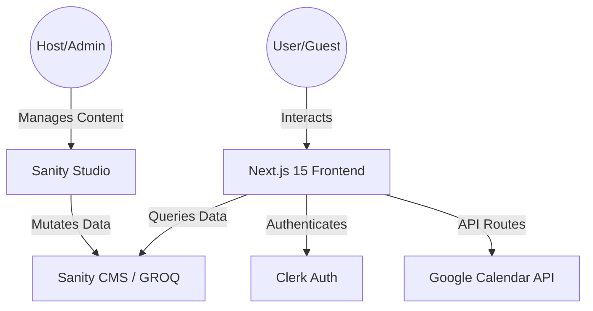
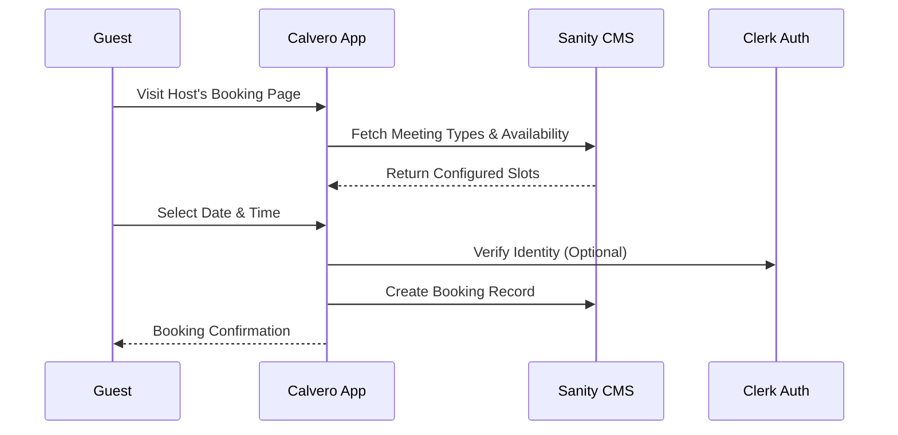

# Calvero

<div align="center">

**Modern Meeting Scheduling System**
*A premium, high-performance platform for seamless appointment booking and management.*

[](https://nextjs.org/)
[](https://react.dev/)
[](https://www.sanity.io/)
[](https://clerk.com/)
[](https://tailwindcss.com/)

</div>

---

## 🌟 Overview

Calvero is built for performance and professional utility. It streamlines the connection between hosts and guests with a robust scheduling engine, real-time availability sync, and a full-featured admin studio.

### Key Capabilities
- **Effortless Booking**: Intuitive scheduling flow for users with dynamic time-zone aware slots.
- **Dynamic Content Management**: Powered by **Sanity CMS**, allowing hosts to manage meeting types and availability on the fly.
- **Enterprise-Grade Auth**: Secure user management and session handling via **Clerk**.
- **Admin Studio**: A specialized dashboard to manage scheduling rules, user metadata, and content schemas.
- **High Performance**: Built on **Next.js 15 App Router** with React 19 server components for near-instant load times.

---

## 🏗️ Architecture

Calvero uses a modern "Headless" architecture where content management is decoupled from the frontend, ensuring high scalability and developer flexibility.



---

## 🔄 Booking Process Flow

The system ensures a smooth journey from landing to confirmation, handling edge cases like availability conflicts.



---

## 🛠️ Tech Stack

- **Framework**: [Next.js 15 (App Router)](https://nextjs.org/)
- **UI Library**: [React 19](https://react.dev/)
- **State Management & CMS**: [Sanity.io](https://www.sanity.io/)
- **Authentication**: [Clerk](https://clerk.com/)
- **Styling**: [Tailwind CSS 4.0](https://tailwindcss.com/)
- **Icons**: [Lucide React](https://lucide.dev/)
- **Validation & Formatting**: [Biome](https://biomejs.dev/)

---

## 🚀 Getting Started

### Prerequisites
- Node.js 18+
- pnpm / npm / yarn
- Sanity Project ID
- Clerk API Keys

### Installation

1. **Clone the repository**
   ```bash
   git clone https://github.com/your-username/calvero.git
   cd calvero
   ```

2. **Install dependencies**
   ```bash
   pnpm install
   ```

3. **Configure Environment Variables**
   Create a `.env.local` file in the root:
   ```env
   NEXT_PUBLIC_SANITY_PROJECT_ID=...
   NEXT_PUBLIC_SANITY_DATASET=...
   NEXT_PUBLIC_CLERK_PUBLISHABLE_KEY=...
   CLERK_SECRET_KEY=...
   ```

4. **Run Development Server**
   ```bash
   pnpm dev
   ```

Visit `http://localhost:3000` to see your local instance.

---

## 🎯 Hiring & Contact

Developed with a focus on **Software Craftsmanship** and **System Scalability**. If you're looking for a developer who understands modern full-stack architecture, let's connect!

- **LinkedIn**: https://in.linkedin.com/in/harshit-lohar-97a653257

---

<div align="center">
Built with 👩‍💻 by Harshit Lohar
</div>
